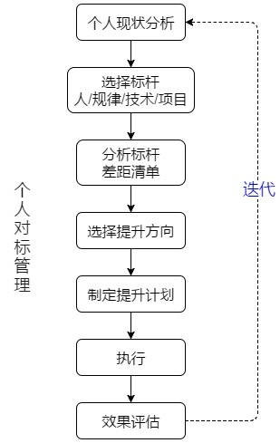

# Blanbok的博客

  我希望我可以用这个博客来进一步提高我的技能并且记住我在技术进步的过程中我的感受这样我就能更好地改进自己
    
  现在我的目标仅仅是让我自己在技术上达到国内前30%，并且掌握能成功的方法。
  
  我希望这种方式能让我不会对之后的生活感到迷惑
  
  每次一个阶段完结的时候，我将会试图优化这些方法
  
  最后，之后我将会把这些方法变成完全适用于我个人的方法
 
   以下是我在搭建博客之前会在github中记录的东西
 
# 1、[关于自己的对标管理](./DetailInformation/BenchmarkingManagement.md)
> 通过标准的方式进行提升

# 2、[三个问题](./DetailInformation/ThreeQuestions.md)
> 写下每天的问题来思考如何改善我的行为

# 3、[刻意练习](./DetailInformation/DeliberatePractice.md)
> 人们眼中的天才之所以卓越非凡，并非天资超人一等，而是付出了持续不断的努力。1万小时的锤炼是任何人从平凡变成世界级大师的必要条件。

