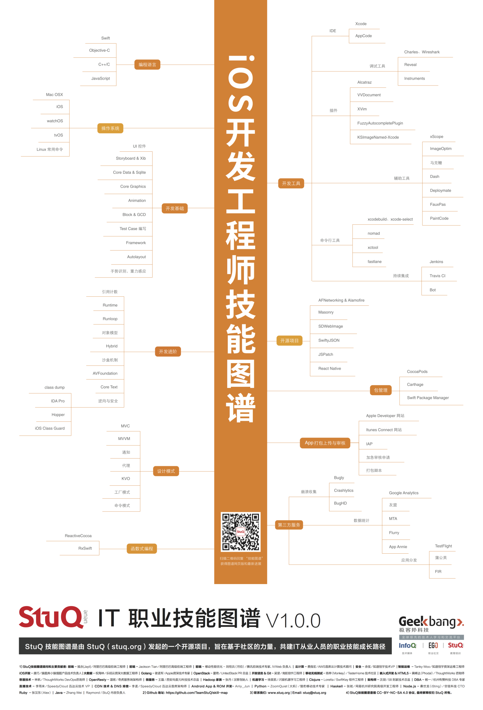

# Blanbok的技术笔记

  我希望可以用这个笔记来进一步提高自己的技能并且记住在技术进步的过程中的感受这样就能更好地改进自己
    
  现在我的目标仅仅是让自己在技术上达到国内前30%，并且掌握能成功的方法。
  
  我希望这种方式能让自己不会对之后的生活感到迷惑
  
  每次一个阶段完结的时候，我将会试图优化这些方法
  
  最后，之后我将会把这些方法变成完全适用于我个人的方法
 
  以下记载在github中的东西仅作为**博客**的雏形
 
# 1、[关于自己的对标管理](./DetailInformation/BenchmarkingManagement.md)
> 通过标准的方式进行提升

# 2、三个问题
> 写下每天的问题来思考如何改善我的行为

# 3、刻意练习
> 人们眼中的天才之所以卓越非凡，并非天资超人一等，而是付出了持续不断的努力。1万小时的锤炼是任何人从平凡变成世界级大师的必要条件。

# 4、[Review](./DetailInformation/Review.md)
>通过Review,总结各个阶段得到的经验，好的总结经验指导下次行动，差的反思原因制定提升策略。

# 5、[技能树](./DetailInformation/SkillTree.md)
>通过建立自己的技能树，用可见的方式来看到自己的成长。

